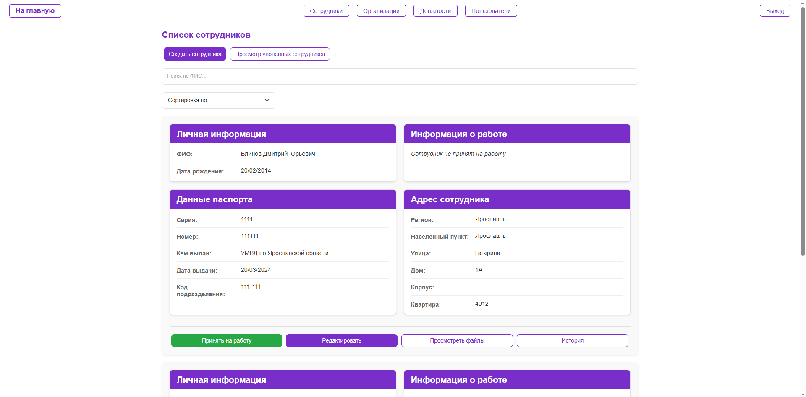
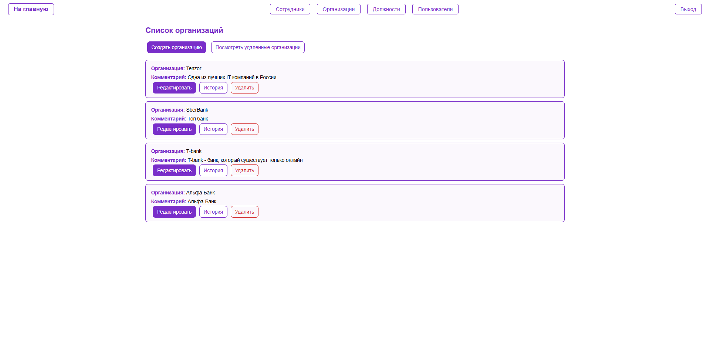
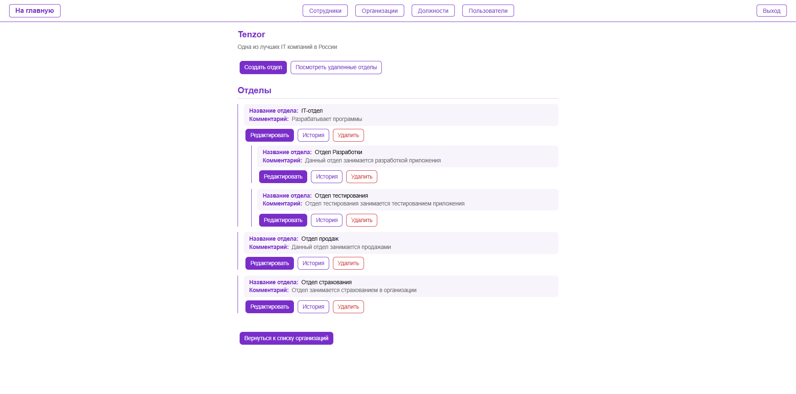
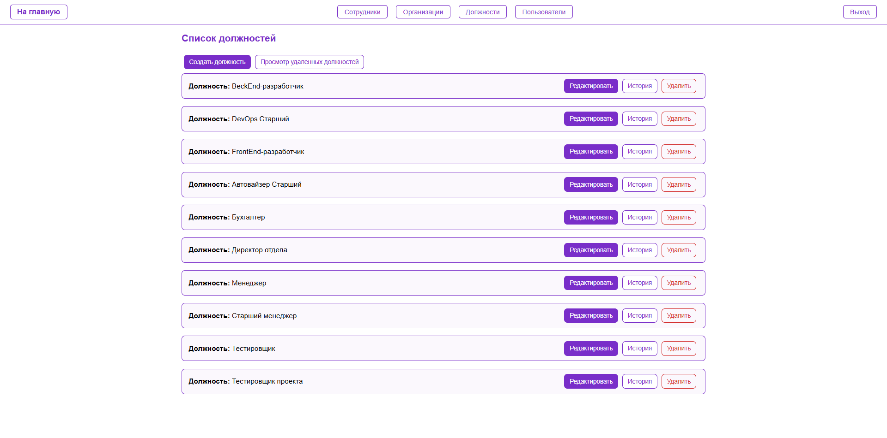

# Обзор функций

Система Areal-hr_ext-test предоставляет широкий спектр функций для управления персоналом.

## Основные функциональные блоки

### Управление сотрудниками

- Создание и редактирование сотрудников
- Просмотр детальной информации о сотрудниках
- Поиск и фильтрация сотрудников по различным параметрам
- История изменений данных сотрудников
- Управление документами и файлами сотрудников
- Назначение должностей, отделов и зарплат

### Управление отделами

- Создание и редактирование отделов
- Просмотр структуры отделов организации

### Управление организациями

- Создание и редактирование организаций
- Связь отделов с организациями

### Управление документами

- Загрузка и хранение документов сотрудников
- Просмотр истории загруженных документов
- Типизация документов по категориям

### Управление доступом

- Аутентификация пользователей
- Авторизация и контроль доступа к функциям
- Защита данных от несанкционированного доступа

## Скриншоты интерфейса
Скриншот главной страницы\
\
Скриншоты страницы сотрудников\
\
Скриншоты страницы организаций\
\
Скриншоты страницы отделов\
\
Скриншоты страницы должностей\

## Взаимосвязь функций

Функциональные модули системы тесно взаимосвязаны:
- Сотрудники связаны с отделами через HR-информацию
- Отделы принадлежат организациям
- Файлы и документы привязаны к сотрудникам
- История изменений отслеживает модификации во всех модулях
